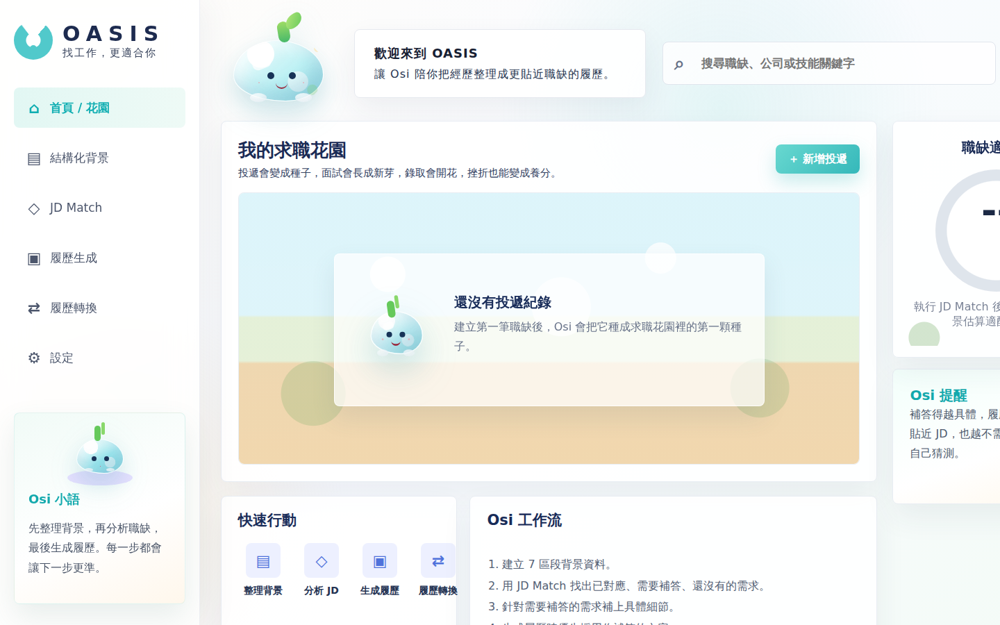
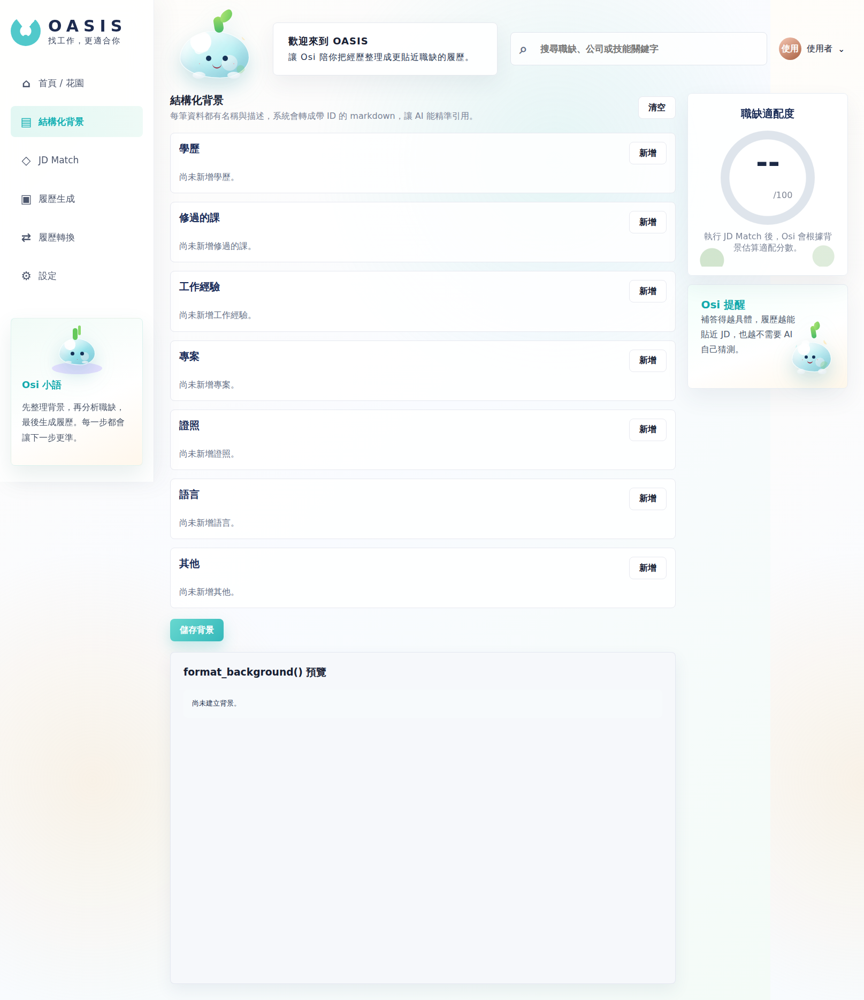
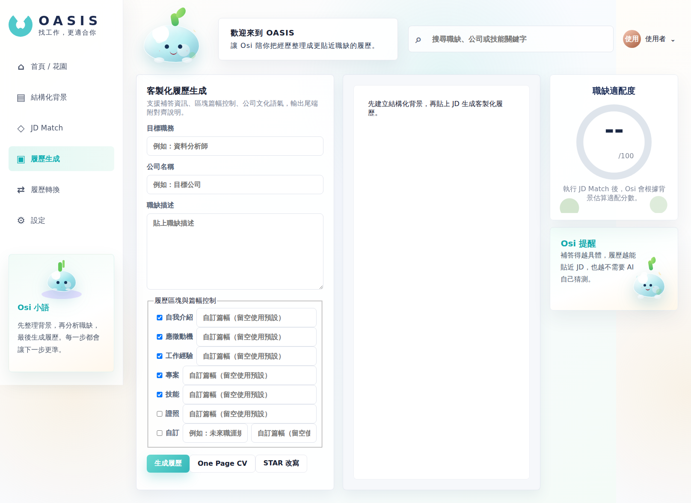
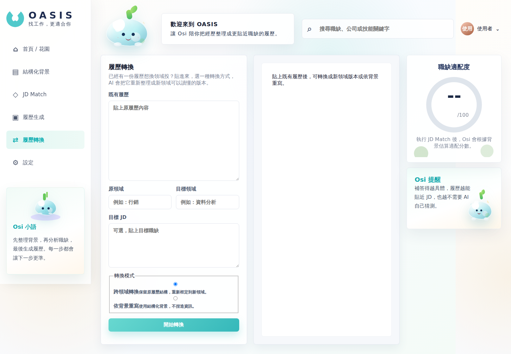

# OASIS

AI-assisted resume platform for cross-disciplinary job seekers.

OASIS focuses on improving trust and transparency in AI-generated resumes by grounding outputs in structured and verified user experiences instead of hallucinated content.



---

## Why I Built This

While applying for jobs across different fields, I tried several AI resume tools and noticed the same problem repeatedly:

The writing sounded polished, but it did not feel like *my* experience.

For example, when using a finance resume to apply for technical roles, most tools simply replaced keywords like “risk modeling” with “data modeling,” while ignoring actual technical experiences such as personal projects or programming coursework. Since the entire background was treated as one large block of text, the AI could only rephrase information instead of understanding it.

Another issue was hallucinated achievements. Many tools automatically generated metrics such as “improved efficiency by 30%,” even when the user never provided those numbers. The output looked impressive, but became difficult to explain during interviews.

OASIS was built to address this problem.

Instead of generating resumes directly from raw text, the system first analyzes the relationship between job requirements and a user’s verified background. The AI then asks follow-up questions for missing details before generating the final content.

The goal is simple:

> Keep the facts human. Let AI handle structure, alignment, and presentation.

---

## Core Features

### Structured Background Management

User backgrounds are separated into structured sections such as education, coursework, work experience, projects, certifications, languages, and additional experiences.

Each entry has its own unique ID, allowing the system to reference experiences precisely during JD analysis and resume generation.

---

### JD Match Analysis

The system breaks down a job description into core requirements and maps them against the user’s background.

Results are categorized into:

* **Direct Match** — clearly supported by existing experiences
* **Implicit Match** — related experiences that require more detail
* **Gap** — requirements with insufficient supporting material

For implicit matches, OASIS generates follow-up questions to collect missing context before resume generation.

---

### AI Resume Generation

Users can customize resume sections and output styles.

Instead of rewriting everything blindly, OASIS uses the structured background and JD analysis results to generate resumes grounded in verified information.

The system also explains why certain experiences were selected or emphasized.

---

### Resume Conversion

Supports two modes:

* **Translate Mode** — preserves the original resume structure while reframing experiences for another domain
* **Rewrite Mode** — rebuilds the resume entirely from structured background data

---

### Job Application Garden

A lightweight visualization system that turns the job search process into a growth journey:

* Applications become seeds
* Interviews begin to sprout
* Offers bloom into flowers
* Rejections become fertilizer for future growth

The idea came from the belief that setbacks are still part of progress.

---

## Technical Stack

```text
Frontend (Vanilla JS) ─HTTP─► FastAPI Backend ─HTTP─► OpenAI
                                     │
                                     └── SQLite / PostgreSQL
```

### Backend

* FastAPI
* SQLAlchemy 2
* Pydantic v2
* JWT Authentication
* bcrypt

### AI / Data

* OpenAI API
* JSON Mode
* Structured Prompt Engineering
* RAG-inspired workflow design

### Frontend

* Vanilla JavaScript
* HTML / CSS

The frontend intentionally avoids heavy frameworks because the project focuses more on workflow design and AI interaction architecture than frontend framework complexity.

---

## Engineering Decisions

### Prompts Stay on the Backend

In the early prototype, prompts were written directly in frontend JavaScript.

However, this created a security issue: users could modify prompts through browser DevTools and bypass restrictions.

To prevent prompt injection and unauthorized behavior, all prompts were moved to the backend. The frontend now only sends structured JSON requests.

---

### OpenAI Keys Are Never Exposed

The frontend uses a separate application token for authentication, while the actual OpenAI API key remains inside backend environment variables.

This separation reduces security risks and allows token rotation independently.

---

### Structured Background IDs

Every background entry includes a unique identifier such as:

```text
experiences-1
courses-2
projects-3
```

This allows the system to map JD requirements precisely and avoid unreliable string matching between experiences.

---

### JSON Mode for Stability

Earlier versions relied on parsing markdown responses with regex, which frequently broke output formatting.

Switching to OpenAI JSON mode significantly improved consistency and reduced parsing failures.

---

## Screenshots

### Structured Background



### Resume Generation Workflow



### Resume Conversion



---

## Future Plans

* Streaming AI responses
* PDF / DOCX export
* Resume self-check system for hallucination detection
* Multi-user collaboration and mentor review system
* Portfolio generation support

---

## Personal Reflection

OASIS started from a personal frustration during cross-disciplinary job applications, but gradually became an exploration of a broader question:

> How should AI assist people without replacing their identity?

Rather than generating impressive-looking content automatically, I wanted to build a system that helps users organize and present their real experiences more clearly.

This project also changed how I think about AI products.

I realized that the real challenge is not only model capability, but also workflow design, transparency, and user trust.

---

## License

MIT License
